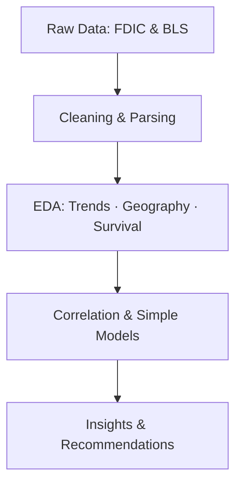

# Business Failure Prediction Project


> Analyze how **bank failures** and **business survival** move together over time using FDIC (bank failures) and BLS (business dynamics) data. 
> This repository includes data cleaning, EDA, lightweight modeling, and clear visuals to communicate insights.

---

## 🔍 What’s inside
- `Business_Failure_Analysis.ipynb` — the full Jupyter notebook with code, visuals, and commentary
- Reproducible environment via `requirements.txt`
- Ready‑to‑use visuals for your GitHub README

## 📊 Visual Preview (illustrative)
> The following is a *conceptual* preview image for the README. The actual figures are generated in the notebook with real data.


## 🧭 Project Structure
```
.
├── Business_Failure_Analysis.ipynb
├── requirements.txt
├── banner.png
└── illustrative_trend.png
```

## 🧠 Methods at a glance
- Data cleaning & harmonization (column fixes, type parsing)
- Descriptive statistics & EDA (time series, geo, correlations)
- Simple modeling to study relationships (e.g., OLS/regression)
- Diagnostics & interpretation (assumptions, multicollinearity checks)

## 🧩 Key Libraries
`pandas`, `numpy`, `matplotlib`, `seaborn`, `statsmodels`, `scikit‑learn`

## ▶️ Quickstart
```bash
# 1) Create and activate a virtual environment (optional but recommended)
python -m venv .venv && source .venv/bin/activate  # Windows: .venv\Scripts\activate

# 2) Install dependencies
pip install -r requirements.txt

# 3) Open the notebook
jupyter notebook Business_Failure_Analysis.ipynb
# or
jupyter lab Business_Failure_Analysis.ipynb
```

## 📘 Notebook Outline (detected)
The notebook includes these sections (auto‑detected):
- # Business Failure Prediction Project
- ## Import Libraries
- ## Load and Explore the FDIC Bank Failure Data
- ## Remove unexpected spaces from the column names
- ## Clean and Prepare FDIC Data
- ## Load and Parse BLS Survival Data
- # Exploratory Data Analysis
- ## Bank Failures Over Time
- ## Business Survival Analysis
- # Correlation Analysis Between Bank Failures and Business Health
- ## Visualization of Correlation
- ## Geographic Analysis

## 🗺️ Analysis Flow (Mermaid)


## ✅ Reproducibility Notes
- Set a random seed where applicable for stable results.
- Keep raw data sources versioned or documented (FDIC, BLS snapshots).
- If you run into dependency issues, install versions pinned to your environment.

## 📝 Citation / Credit
If you use this repository, please cite FDIC bank failure data and BLS business dynamics data sources.

---

**Author**: Sayer Bin  
**Contact**: LinkedIn: https://www.linkedin.com/in/sayershafi · Portfolio: https://sayerbin.com
